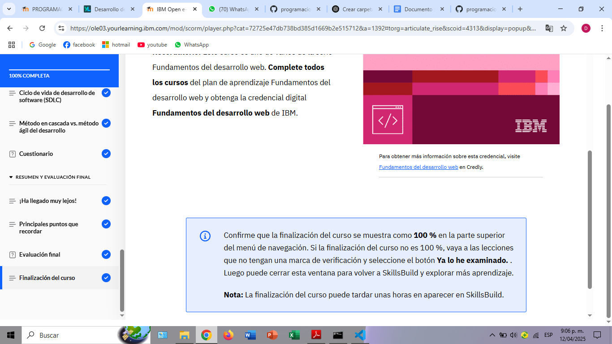

# Documentación del Módulo 2: Desarrollo de Sitios para la Web  

En este segundo módulo aprendí cómo se crean los sitios web y conocí los lenguajes más utilizados para su desarrollo: HTML, CSS y JavaScript. También comprendí cómo ha evolucionado el desarrollo web con metodologías más modernas como Scrum.

---

### Exploradores web  
Entendí que los navegadores (como Chrome o Firefox) son herramientas que permiten visualizar e interactuar con los sitios web que los desarrolladores crean.

---

### HTML, CSS y JavaScript  
Aprendí que:
- **HTML** estructura el contenido del sitio web.
- **HTML5** mejoró mucho el lenguaje con nuevas etiquetas y soporte para multimedia.
- **CSS** define los estilos visuales de la página (colores, tamaños, etc.).
- **JavaScript** permite que la página sea interactiva y dinámica.

Además, vi cómo estos tres lenguajes trabajan juntos para crear experiencias web completas.

---

### Ciclo de vida del desarrollo (SDLC)  
Conocí las fases principales del desarrollo de software y comprendí la diferencia entre los enfoques tradicionales (como el modelo en cascada) y el enfoque ágil.

---

### Enfoque ágil y Scrum  
Aprendí qué es Scrum, cómo funciona con sprints y roles específicos, y cómo mejora la organización y entrega de proyectos web.

---

### Mi experiencia  
Este módulo me ayudó a entender mejor cómo se construyen los sitios web desde cero, usando herramientas clave y buenas prácticas de desarrollo.

---

**Duración estimada:** 1 hora, 40 minutos  
**Requisitos:** Visitar todas las páginas, completar actividades, y aprobar el cuestionario final con al menos un 80%.

