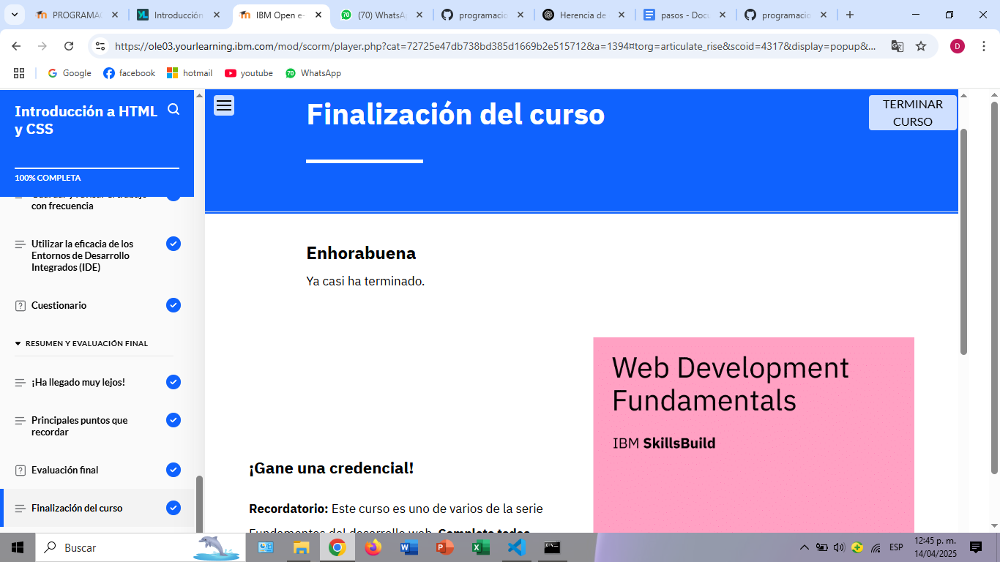

# Introducción a HTML y CSS

En este curso, he aprendido sobre la estructura básica de un documento HTML y los elementos más comunes para la creación de páginas web. A lo largo de las lecciones, exploré los atributos HTML y comprendí la importancia de organizar la información de manera eficiente para una mejor comprensión y mantenimiento del código. 

Uno de los temas más interesantes fue CSS y cómo utilizarlo para diseñar y darle estilo a nuestras páginas web. Aprendí acerca del modelo de cuadro CSS y cómo este modelo se utiliza para manejar márgenes, rellenos, bordes y el contenido de los elementos en una página. Esto me permitió comprender cómo controlar y mejorar la disposición de los elementos de una página web de manera más visual y estructurada.

Además, descubrí las buenas prácticas que los desarrolladores web implementan para escribir código HTML y CSS limpio, organizado y accesible. Estas prácticas son fundamentales para crear páginas web eficientes y mantener un código que sea fácil de modificar y extender.

### Lo que aprendí:
- **HTML:** Conocí los elementos más comunes de HTML y sus atributos, y cómo se usan para crear la estructura básica de una página web.
- **CSS:** Aprendí cómo aplicar estilos a las páginas web usando CSS, entendiendo el modelo de cuadro y cómo gestionar la presentación visual de los elementos.
- **Organización del Código:** Identifiqué técnicas clave para organizar el código, lo cual es esencial para que otros desarrolladores puedan trabajar en él fácilmente.
- **Buenas Prácticas:** Comprendí la importancia de escribir un código limpio, con un uso adecuado de etiquetas y estructuras semánticas, lo que mejora la accesibilidad y el rendimiento de las páginas web.

### Objetivos alcanzados:
- Describir cómo los desarrolladores web utilizan elementos HTML para crear páginas web.
- Explicar y usar atributos comunes de HTML y cómo afectan la funcionalidad de una página.
- Identificar las mejores prácticas para escribir código HTML y CSS limpio y bien organizado.
- Aplicar CSS a HTML de manera eficaz para mejorar el diseño de las páginas.
- Utilizar el modelo de cuadro CSS para controlar la disposición de los elementos en la página.
- Conocer el entorno de desarrollo integrado (IDE) y cómo facilita el trabajo de los desarrolladores.

Este curso me ha proporcionado una base sólida sobre HTML y CSS, lo cual me ayudará a desarrollar páginas web más eficientes y con mejor diseño. Estoy satisfecho con el progreso realizado y me siento más preparado para aplicar estos conocimientos en proyectos futuros.

