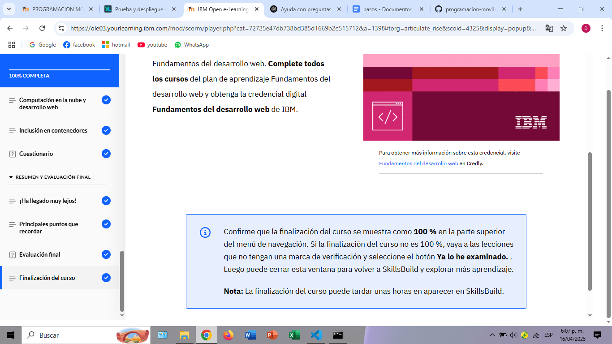

# Módulo 5: Computación en la Nube y Contenerización para el Desarrollo Web

## Introducción
En este módulo, explorarás los conceptos básicos de la computación en la nube y la contenerización, y cómo juegan un papel crucial en el desarrollo web moderno. Entender estos conceptos es esencial para desplegar y escalar aplicaciones web de manera efectiva.

### Computación en la Nube
La computación en la nube se refiere a la entrega de servicios de computación (como almacenamiento, poder de procesamiento y software) a través de Internet. Elimina la necesidad de servidores físicos e infraestructura. Con los servicios en la nube, los desarrolladores pueden centrarse en escribir código y desplegar aplicaciones sin preocuparse por la gestión del hardware.

Beneficios clave de la computación en la nube para el desarrollo web:
- **Escalabilidad**: Los servicios en la nube pueden escalar los recursos hacia arriba o hacia abajo según la demanda, permitiendo que los sitios web manejen picos de tráfico sin problemas.
- **Flexibilidad**: Los desarrolladores pueden utilizar varias herramientas y plataformas en la nube para diferentes aspectos del desarrollo, como bases de datos, alojamiento web y aprendizaje automático.
- **Eficiencia de costos**: Con modelos de pago por uso, los desarrolladores solo pagan por lo que usan, reduciendo costos innecesarios.

Proveedores de la nube más comunes:
- Amazon Web Services (AWS)
- Microsoft Azure
- Google Cloud Platform (GCP)

### Contenerización
La contenerización es un método de empaquetar y ejecutar aplicaciones en entornos aislados conocidos como contenedores. Estos contenedores incluyen todo lo necesario para que la aplicación se ejecute: código, bibliotecas y herramientas del sistema.

