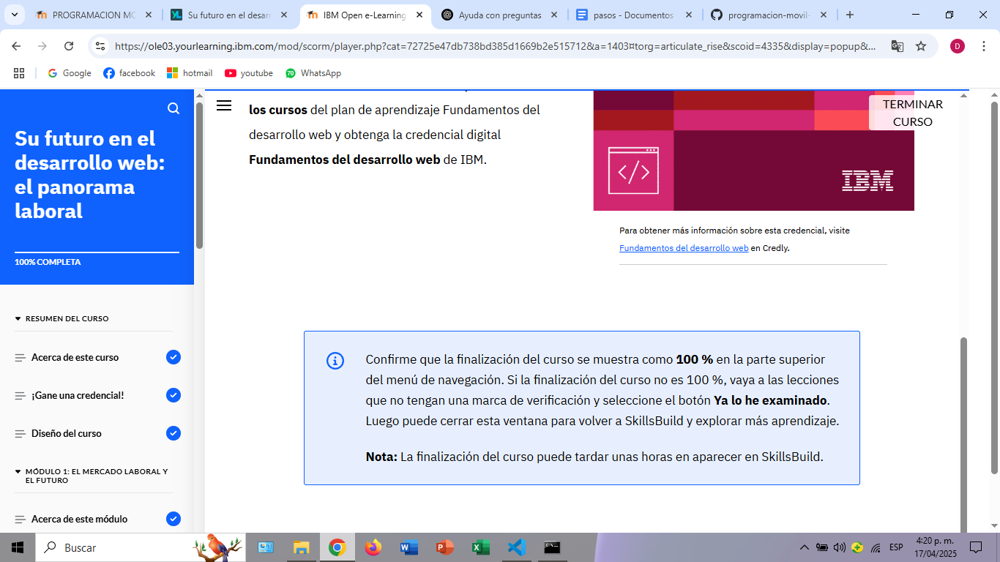

# Módulo 7: Su futuro en el desarrollo web

## Acerca de esta actividad formativa

En este curso, aprendí sobre el mercado laboral del desarrollo web, las competencias clave que los desarrolladores web necesitamos para tener éxito y cómo interactuamos con otros roles dentro de un equipo. A lo largo de las actividades, me quedó claro que la demanda de desarrolladores sigue creciendo debido a que las empresas reconocen la importancia de tener presencia digital. Además, exploré los distintos roles y responsabilidades en un equipo de desarrollo web, lo cual me ayudó a entender mejor cómo encajo profesionalmente en este campo.

## Lo que aprendí

Después de completar este módulo, puedo:

Identificar los sectores donde se desempeñan los desarrolladores web.

Reconocer la alta demanda de profesionales del desarrollo web en el mercado global.

Entender las tendencias futuras del desarrollo web.

Distinguir entre los diferentes roles como front-end, back-end y full-stack.

Explicar las responsabilidades específicas de cada rol.

Reconocer la importancia de las competencias técnicas y blandas.

Distinguir los roles que conforman un equipo de desarrollo web.

Acceder a recursos útiles para mantenerme actualizado.

## Reflexión personal

Este módulo me ayudó a tener una visión mucho más clara del panorama profesional que ofrece el desarrollo web. Me gustó ver cómo las habilidades técnicas deben complementarse con habilidades de comunicación, pensamiento crítico y trabajo en equipo. El conocer los distintos roles dentro del desarrollo me permite orientar mejor mis próximos pasos de aprendizaje. Me motiva mucho saber que hay una amplia demanda de estos perfiles, y quiero seguir explorando más recursos para fortalecer mi carrera en este ámbito.

