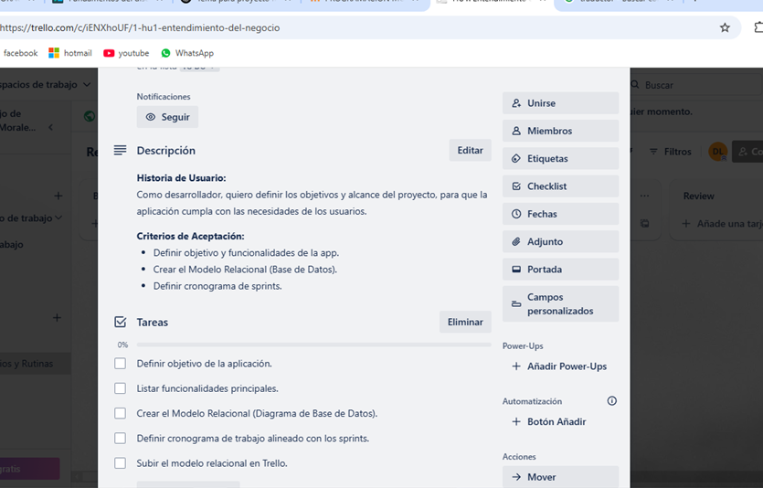
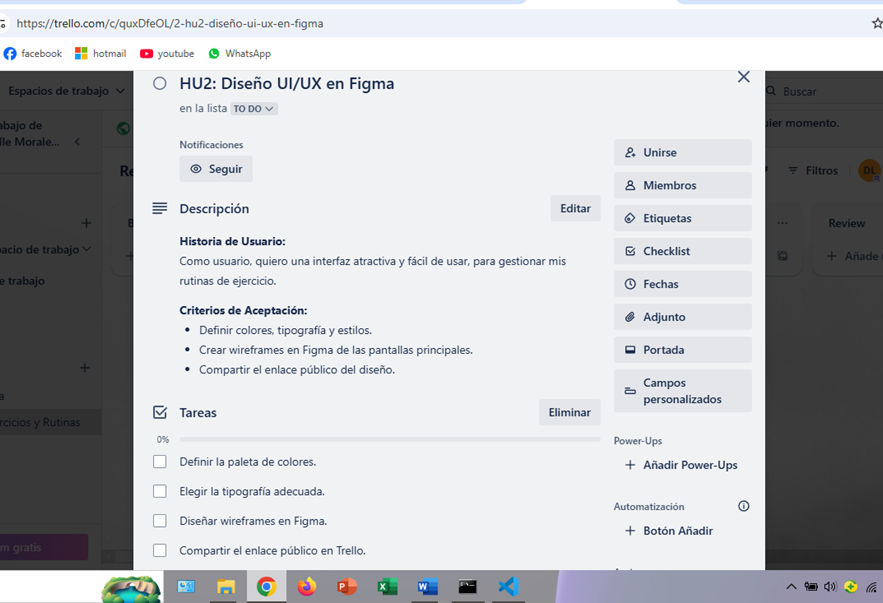

 # 📱 Registro de Ejercicios y Rutinas  
 Aplicación móvil para gestionar ejercicios y rutinas de entrenamiento.  

##  Descripción  
Esta aplicación permite registrar ejercicios, crear rutinas personalizadas y hacer seguimiento del progreso.  

##  Organización del Proyecto  
El desarrollo se gestiona con **Trello**, **Figma**, **GitHub** y sigue un enfoque basado en **Historias de Usuario (HU)** organizadas en sprints.  

##  Sprint 1 - Planificación  
###  **HU1: Comprensión del problema**  
- 📌 Definir objetivo de la aplicación.  
- 📝 Listar funcionalidades principales.  
- 📊 Crear el Modelo Relacional (Diagrama de Base de Datos).  
- 🗓 Definir cronograma de trabajo alineado con los sprints.  
- 📤 Subir el modelo relacional en Trello.  

###  **HU2: Diseño UI/UX en Figma**  
- 🎨 Definir la paleta de colores.  
- 🔤 Elegir la tipografía adecuada.  
- 📐 Diseñar wireframes en Figma.  
- 🔗 Compartir el enlace público en Trello.  

