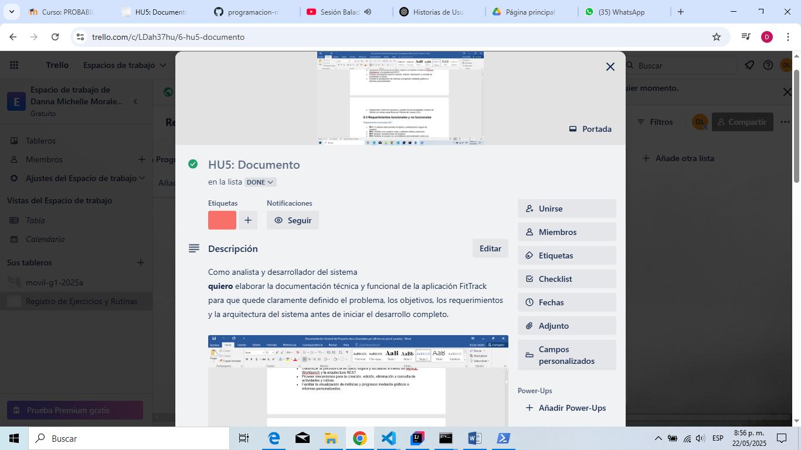

# HU5: Documento Técnico y Funcional

**Como** analista y desarrollador del sistema,  
**quiero** elaborar la documentación técnica y funcional de la aplicación **FitTrack**,  
**para que** quede claramente definido el problema, los objetivos, los requerimientos y la arquitectura del sistema antes de iniciar el desarrollo completo.

---

## ✅ Criterios de Aceptación

- Redactar el **planteamiento del problema**, identificando la necesidad de una herramienta accesible para el seguimiento de rutinas y ejercicios.
- Definir el **objetivo general** y los **objetivos específicos** del sistema.
- Listar los **requerimientos funcionales (RF)** y **no funcionales (RNF)** del sistema.
- Especificar la **arquitectura del sistema**, detallando tecnologías utilizadas en frontend, backend y base de datos.
- Crear el **modelo relacional (MER)** y explicar brevemente sus entidades.
- Redactar el **manual de usuario**, incluyendo:
  - Acceso y autenticación
  - Gestión de ejercicios y rutinas
  - Visualización de progreso
  - Modificación y eliminación
- Adjuntar **evidencias** como capturas, enlaces al documento o archivo PDF compartido en GitHub, Google Drive o repositorio.

---

## 🛠️ Tecnologías y Herramientas Referenciadas

| Componente            | Tecnología/Herramienta | Descripción                             |
|-----------------------|------------------------|-----------------------------------------|
| **Frontend**          | Ionic + React          | UI móvil y responsiva                   |
| **Backend**           | Spring Boot            | API REST para lógica del sistema        |
| **Base de datos**     | MySQL Workbench        | Gestión relacional de datos             |
| **Control de versiones** | GitHub             | Gestión de código por ramas (HU)        |
| **Gestión de tareas** | Trello / GitHub Projects | Seguimiento del backlog y avances  |
| **Diagramas**         | draw.io                | Diseño de MER, UML y arquitectura       |

