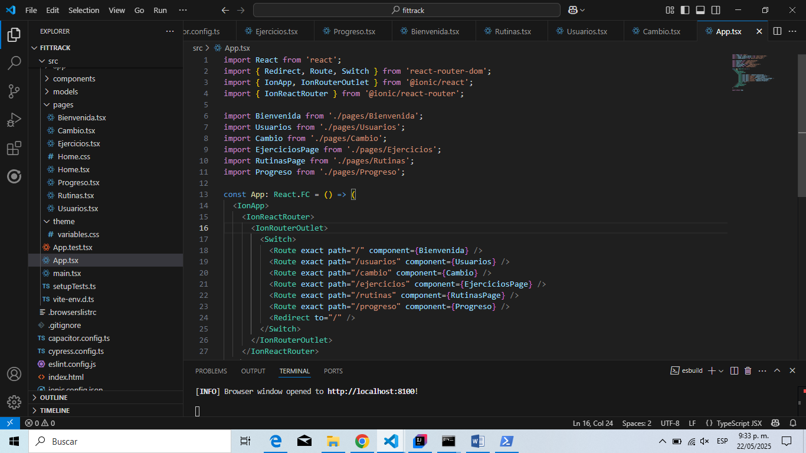

# Historia de Usuario HU-06 - Frontend

**Como** desarrollador del sistema FitTrack  
**Quiero** construir la interfaz de usuario utilizando Ionic con React  
**Para** que los usuarios puedan interactuar fácilmente con las funcionalidades del sistema desde sus dispositivos móviles de manera intuitiva y responsiva.

## ✅ Criterios de Aceptación
- Crear el proyecto base con Ionic + React.
- Configurar el diseño general con una estructura modular y reutilizable.
- Implementar las vistas principales del sistema:
  - Página de inicio
  - Módulo de ejercicios
  - Módulo de rutinas
  - Módulo de progreso
- Crear componentes funcionales para:
  - Formulario de registro e inicio de sesión
  - Listado y creación de ejercicios
  - Listado y creación de rutinas
  - Visualización de métricas de progreso
- Aplicar estilos personalizados para una interfaz amigable y moderna.
- Verificar que el diseño sea responsivo en distintos tamaños de pantalla.
- Consumir servicios REST del backend para mostrar datos reales desde la base de datos.

